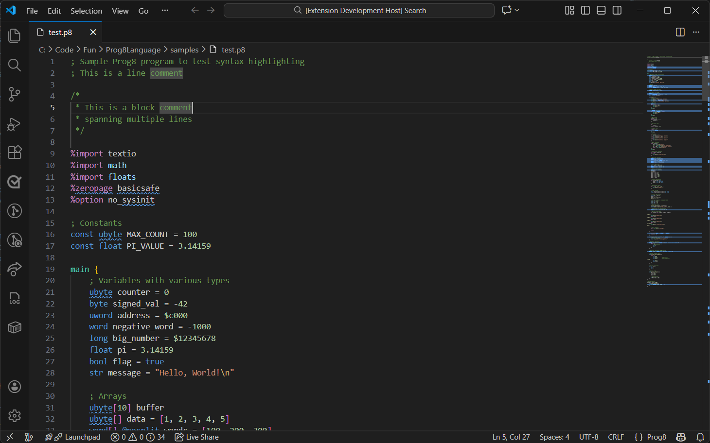

# Prog8 Language Support for VS Code

Syntax highlighting and language support for [Prog8](https://prog8.readthedocs.io/), a structured programming language for 8-bit 6502/65c02 microprocessors.



## Features

- **Syntax Highlighting** for `.p8` files including:
  - Keywords and control flow (`if`, `else`, `for`, `while`, `repeat`, `when`, `sub`, etc.)
  - Data types (`byte`, `ubyte`, `word`, `uword`, `long`, `float`, `bool`, `str`)
  - Compiler directives (`%import`, `%address`, `%zeropage`, `%asm`, etc.)
  - String literals with encoding prefixes (`petscii:`, `sc:`, `iso:`, etc.)
  - Numeric literals (decimal, hexadecimal `$`, binary `%`)
  - Built-in functions (`len`, `sizeof`, `lsb`, `msb`, `rol`, `ror`, etc.)
  - Inline assembly blocks with 6502 instruction highlighting
  - Comments (`;` line comments and `/* */` block comments)
  - Operators and special syntax
  - Virtual registers (`r0`-`r15` and variants)
  - Library modules (`txt`, `sys`, `math`, `floats`, etc.)

- **Language Configuration**:
  - Auto-closing brackets and quotes
  - Comment toggling
  - Code folding
  - Proper indentation

## Supported Targets

Prog8 supports these retro computer platforms:
- **Commander X16** (65c02 CPU)
- **Commodore 64** (6502 CPU)
- **Commodore 128** (6502 CPU)
- **Commodore PET** (limited support)
- Various external configurable targets (Atari 800 XL, Neo6502, NES, etc.)

## Example Code

```prog8
%import textio
%zeropage basicsafe

main {
    sub start() {
        txt.print("Hello, Prog8!\n")
        
        ubyte counter
        for counter in 0 to 10 {
            txt.print_ub(counter)
            txt.nl()
        }
        
        return
    }
}
```

## Installation

### From VSIX

1. Download the `.vsix` file from the releases
2. In VS Code, open Command Palette (`Ctrl+Shift+P`)
3. Run "Extensions: Install from VSIX..."
4. Select the downloaded file

### From Source

1. Clone this repository
2. Run `npm install` (if using npm scripts)
3. Press F5 to launch Extension Development Host
4. Open a `.p8` file to see syntax highlighting

### Package as VSIX

```bash
npm install -g @vscode/vsce
vsce package
```

## File Associations

This extension automatically associates with `.p8` file extensions.

## Related Links

- [Prog8 Documentation](https://prog8.readthedocs.io/)
- [Prog8 GitHub Repository](https://github.com/irmen/prog8)
- [Commander X16](https://www.commanderx16.com/)
- [Prog8 Discord Channel](https://discord.gg/nS2PqEC) (on Commander X16 Discord)

## Contributing

Contributions are welcome! Please feel free to submit issues or pull requests.

## License

This extension is released under the MIT License.

---

**Enjoy coding in Prog8!** 🎮
